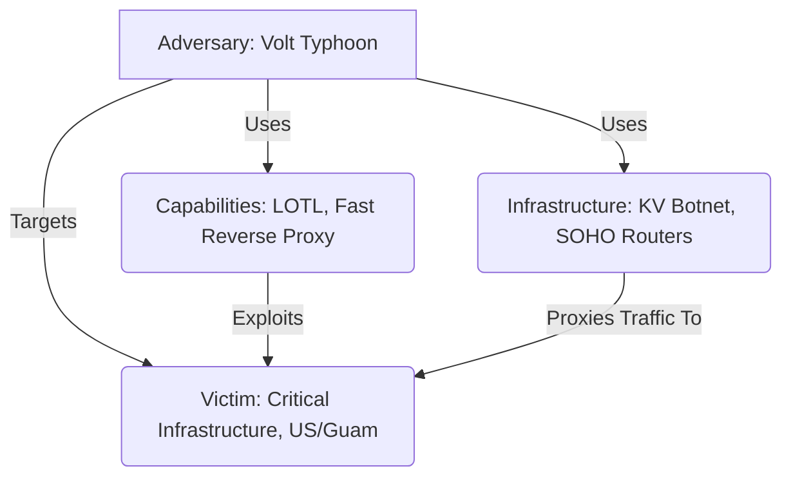
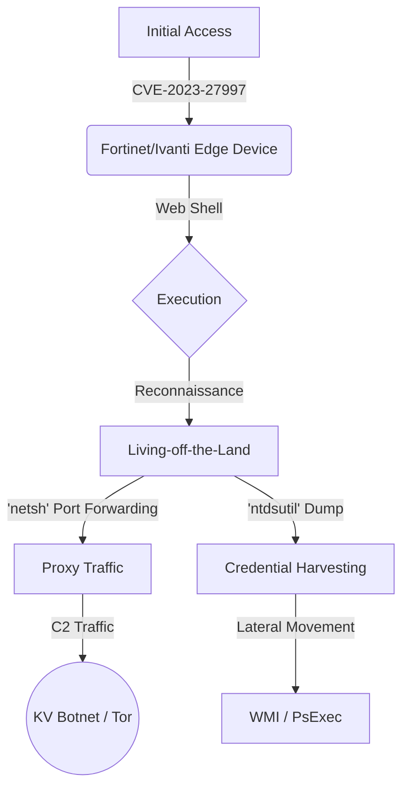

# Volt Typhoon Threat Intel Report

THREAT LEVEL: CRITICAL (Nation-State)

Subject: Operation Volt Typhoon (Living-off-the-Land Espionage)

Author: Nihal

Date: January 2, 2026

## 1. Executive Summary
**Volt Typhoon** (aka Vanguard Panda / BRONZE SILHOUETTE) is a state-sponsored threat actor (PRC-nexus) targeting critical infrastructure sectors (Communications, Manufacturing, Utility, Transportation). Unlike typical ransomware gangs, their objective is **Espionage and Pre-positioning** for potential disruption.

**Why this is unique:** They use almost **zero malware**. Instead, they rely entirely on "Living-off-the-Land" (LOTL) techniques—abusing legitimate administrative tools (PowerShell, WMI, netsh) already present on the system. This makes traditional antivirus detection nearly useless.

## 2. The Diamond Model of Intrusion



| Component | Details |
| :--- | :--- |
| **Adversary** | PRC-Linked Espionage Group. Highly disciplined. |
| **Capability** | Exploitation of Edge Devices (Fortinet, Ivanti), LOTL Binaries, Credential Dumping (`ntdsutil`). |
| **Infrastructure** | **KV Botnet:** A network of compromised SOHO routers (Cisco, Netgear) used to proxy traffic and hide their true origin. |
| **Victim** | Government, Defense, and Utility sectors. |

## 3. Visual Attack Chain



## 4. Technical Deep Dive

### Phase 1: Initial Access (Edge Exploitation)
They target internet-facing devices like **FortiGuard** and **Ivanti Connect Secure** gateways. They do not send phishing emails; they exploit unpatched vulnerabilities (e.g., CVE-2023-27997) to gain a foothold.

### Phase 2: The "KV Botnet" (Traffic Hiding)
Volt Typhoon routes their traffic through a network of compromised Small Office/Home Office (SOHO) routers. This allows their attacks to originate from seemingly legitimate domestic IP addresses, bypassing "Geo-Blocking" rules.

### Phase 3: Living-off-the-Land (LOTL)
Once inside, they strictly avoid dropping files.
*   **Command Execution:** `wmic process call create "cmd.exe /c..."`
*   **Credential Theft:** Instead of Mimikatz (which is flagged), they use the built-in Active Directory tool:
    `ntdsutil "ac i ntds" "ifm" "create full c:\temp\dump" q q`
*   **Port Forwarding:** `netsh interface portproxy add v4tov4 ...`

## 5. Detection Engineering (SIEM Queries)

Since there are no "virus files" to find, we must hunt for **anomalous behavior**.

### 🔍 Splunk (SPL) - Detecting `ntdsutil` Abuse
```splunk
index=windows EventCode=4688 
| search NewProcessName="*\ntdsutil.exe" 
| search CommandLine="*ifm*" AND CommandLine="*create*" 
| table _time, ComputerName, AccountName, CommandLine
| sort -_time
```

### 🔍 Azure Sentinel (KQL) - Detecting `netsh` Port Forwarding
```kusto
DeviceProcessEvents
| where FileName =~ "netsh.exe"
| where ProcessCommandLine has_all ("interface", "portproxy", "add", "v4tov4")
| project TimeGenerated, DeviceName, InitiatingProcessAccountName, ProcessCommandLine
```

### 🔍 Sigma Rule (Standard) - Suspicious WMIC Execution
```yaml
title: Suspicious WMIC Process Creation
id: 55667788-9900-aabb-ccdd-eeff00112233
status: high
description: Detects the use of WMIC to spawn command prompts, a favorite technique of Volt Typhoon for lateral movement.
author: Nihal
logsource:
  category: process_creation
  product: windows
detection:
  selection:
    Image|endswith: '\wmic.exe'
    CommandLine|contains|all:
      - 'process'
      - 'call'
      - 'create'
      - 'cmd.exe'
  condition: selection
level: high
```

## 6. Static Analysis (YARA)

While they use few tools, they sometimes drop a modified **Fast Reverse Proxy (FRP)** or **Earthworm** for tunneling.

```yara
rule TOOL_FastReverseProxy_FRP {
    meta:
        description = "Detects FRP (Fast Reverse Proxy) often used by Volt Typhoon"
        author = "Nihal"
        severity = "Medium"
    strings:
        $s1 = "frp/client/proxy" ascii
        $s2 = "github.com/fatedier/frp" ascii
        $s3 = "runVisitor" ascii
    condition:
        uint16(0) == 0x457f and 
        2 of them
}
```

## 7. Purple Team Emulation (Validation)

Run these commands to test if your SIEM alerts on Volt Typhoon's behavior.

**1. Mock Credential Dump (Safe)**
*Does not actually dump DB, just checks syntax monitoring.*
```cmd
ntdsutil "ac i ntds" "help" q q
```

**2. Mock Port Forwarding**
```cmd
netsh interface portproxy add v4tov4 listenport=8080 listenaddress=0.0.0.0 connectport=80 connectaddress=192.168.1.1
# Cleanup: netsh interface portproxy delete v4tov4 listenport=8080 listenaddress=0.0.0.0
```

## 8. Mitigation & Hardening

1.  **Strict "Living-off-the-Land" Policies:** Use **AppLocker** or **WDAC** to block the execution of `cmd.exe` or `powershell.exe` by standard users (e.g., the web server service account).
2.  **Edge Patching:** Enforce a 48-hour SLA for patching internet-facing appliances (VPNs, Firewalls).
3.  **Clean Up Legacy Routers:** Identify any SOHO routers (Cisco, Netgear) on the network edge that are End-of-Life and remove them.
4.  **Audit Logs:** Ensure **Process Command Line Logging** (Event ID 4688) is enabled. You cannot detect Volt Typhoon without it.

## Platform Things

### Event Logs (Windows Security Simulation)

```text
eventdate,hostname,user,processid,image,processcommandline,targetfilename,targetobject,details,destinationip,destinationport,protocol,hashes
2026-01-02 15:30:00,SRV-DC01,SYSTEM,880,C:\Windows\System32\ntdsutil.exe,"ntdsutil \"ac i ntds\" \"ifm\" \"create full c:\\temp\\dump\" q q",-,-,-,-,-,-,-
2026-01-02 15:35:00,SRV-WEB01,NETWORK SERVICE,1024,C:\Windows\System32\wbem\WMIC.exe,"wmic process call create \"cmd.exe /c net user guest /active:yes\"",-,-,-,-,-,-,-
2026-01-02 15:40:00,SRV-WEB01,NETWORK SERVICE,1055,C:\Windows\System32\netsh.exe,"netsh interface portproxy add v4tov4 listenport=8443 connectaddress=10.0.0.5 connectport=3389",-,-,-,192.168.1.5,3389,TCP,-
```

