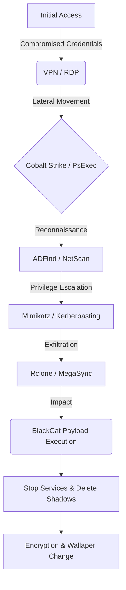

# BlackCat (ALPHV) Threat Intel Report

THREAT LEVEL: CRITICAL

Subject: BlackCat (ALPHV) Ransomware Analysis

Author: Nihal

Date: January 2, 2026

## High-Level Summary

BlackCat (also known as ALPHV) was the first major ransomware strain written in **Rust**. This choice of language makes it highly stable and cross-platform, allowing it to target Windows, Linux, and **VMware ESXi** hypervisors simultaneously. BlackCat is a RaaS (Ransomware-as-a-Service) that employs triple-extortion tactics and is known for its extreme customization options for affiliates.

## Quick Look

| Attribute          | Details                                                               |
| :----------------- | :-------------------------------------------------------------------- |
| Threat Family      | BlackCat / ALPHV / Noberus                                            |
| Attribution        | ALPHV Gang (Likely successors to BlackMatter/DarkSide)                |
| Target Assets      | Domain Controllers, ESXi Servers, Backup Servers                      |
| Primary Objective  | Financial Extortion (Encryption + Data Leak)                          |
| Propagation Vector | Valid Accounts (VPN/RDP), Exchange Vulnerabilities                    |
| Targeted Platforms | **Cross-Platform:** Windows (x64), Linux, VMWare ESXi                 |

## 📊 Visual Attack Chain (Mermaid)



## Threat at a Glance: Key ATT&CK TTPs

*   **T1059.001 (Command and Scripting Interpreter):** Uses PowerShell to disable Defender features.
*   **T1490 (Inhibit System Recovery):** Deletes Shadow Copies (`vssadmin`) and modifies boot config (`bcedit`).
*   **T1027 (Obfuscated Files or Information):** The Rust binary is packed and difficult to reverse engineer.
*   **T1082 (System Information Discovery):** Uses `wmic` and `fsutil` to gather UUIDs and drive types.
*   **T1486 (Data Encrypted for Impact):** Encrypts files using AES or ChaCha20.

## BlackCat Deep Dive: Technical Analysis

### The Rust Advantage
By using Rust, BlackCat achieves lower detection rates from traditional AVs (which struggle with Rust signatures) and high-performance multi-threaded encryption.

### Configuration & Execution
The malware is often executed with specific arguments, requiring an "Access Token" (`--access-token`) to run. Without this token, the binary will not execute, making sandbox analysis difficult.
`alphv.exe --access-token [UUID] --spread-network --no-vm-snapshot-kill`

### ESXi Targeting
On Linux/ESXi, it uses the command line utility `esxcli` to forcefully stop running Virtual Machines before encryption to ensure the VM disk files (`.vmdk`) are not locked and can be corrupted.

## 🛡️ Static Detection (YARA)

Use this rule to detect the BlackCat binary on disk, regardless of the filename.

```yara
rule RANSOM_BlackCat_ALPHV {
    meta:
        description = "Detects BlackCat/ALPHV Rust-based Ransomware"
        author = "Nihal"
        date = "2026-01-02"
        severity = "Critical"
    strings:
        $rust_marker = "/rustc/" ascii
        $s1 = "src/bin/encrypt_app/main.rs" ascii
        $s2 = "alphv_logic" ascii
        $note = "recover-notes.txt" wide ascii
        $cmd_arg = "--access-token" wide ascii
    condition:
        uint16(0) == 0x5A4D and 
        $rust_marker and 
        ($s1 or $s2) and 
        ($note or $cmd_arg)
}
```

## ⚔️ Purple Team Emulation

Run these safe commands to simulate the *behavior* of BlackCat for testing detections.

**1. Simulate Service Stoppage (Safe Mode)**
```powershell
# BlackCat stops these services to ensure open file handles
Write-Host "Simulating BlackCat Service Stop..."
Get-Service -Name "Veeam*", "BackupExec*", "SQL*" -ErrorAction SilentlyContinue
```

**2. Simulate Shadow Copy Deletion (Mock)**
```cmd
:: Don't run this on production!
cmd.exe /c "echo vssadmin.exe Delete Shadows /All /Quiet >> simulation.log"
```

**3. Simulate Network Spreading Flag**
```cmd
:: Mimics the argument parsing
ping 127.0.0.1 -n 1 --access-token 12345 --spread-network
```

## 🔒 Mitigation & Hardening

*   **Restrict Administrative Token Usage:** BlackCat requires an access token. Ensure command-line auditing (Event ID 4688) is enabled to capture these tokens for analysis.
*   **Secure ESXi Management Interfaces:** Put ESXi management ports (443, 902) behind a dedicated management VPN. Do not expose them to the general corporate network.
*   **Tamper Protection:** Enable "Tamper Protection" in Microsoft Defender to prevent the malware from disabling the AV service via PowerShell.
*   **Rust Analysis Tools:** Equip your SOC with tools capable of analyzing Rust binaries (e.g., specialized Ghidra scripts), as standard tools may yield poor results.

## Platform Things

### Event Logs (Windows Security Simulation)

```text
eventdate,hostname,user,processid,image,processcommandline,targetfilename,targetobject,details,destinationip,destinationport,protocol,hashes
2026-01-02 14:00:01,FILESERVER-01,SYSTEM,5012,C:\Windows\System32\cmd.exe,"cmd.exe /c wmic.exe shadowcopy delete",-,-,-,-,-,-,-
2026-01-02 14:00:05,FILESERVER-01,SYSTEM,5033,C:\Windows\System32\bcdedit.exe,"bcdedit /set {default} recoveryenabled No",-,-,-,-,-,-,-
2026-01-02 14:01:00,FILESERVER-01,Administrator,6001,C:\Temp\alphv.exe,"alphv.exe --access-token 328472-3847-2384 --spread-network",-,-,-,-,-,-,a1b2c3d4e5f678901234567890abcdef
```

### Sigma Rules(2)

**Log Event:**
```text
2026-01-02 14:00:05,FILESERVER-01,SYSTEM,5033,C:\Windows\System32\bcdedit.exe,"bcdedit /set {default} recoveryenabled No",-,-,-,-,-,-,-
```

```yaml
title: BCDEdit Recovery Disable
id: ccdd1122-3344-5566-7788-9900aabbccdd
status: high
description: Detects the use of bcdedit to disable Windows system recovery, a common tactic by ransomware like BlackCat to prevent restoration.
author: Nihal
logsource:
  category: process_creation
  product: windows
detection:
  selection:
    Image|endswith: '\bcdedit.exe'
    CommandLine|contains|all:
      - '/set'
      - 'recoveryenabled'
      - 'No'
  condition: selection
level: high
```

**Log Event:**
```text
2026-01-02 14:01:00,FILESERVER-01,Administrator,6001,C:\Temp\alphv.exe,"alphv.exe --access-token 328472-3847-2384 --spread-network",-,-,-,-,-,-,a1b2c3d4e5f678901234567890abcdef
```

```yaml
title: BlackCat/ALPHV Execution Arguments
id: ee00ff11-2233-4455-6677-889900aabbcc
status: critical
description: Detects the specific command line arguments (--access-token) required by BlackCat ransomware to execute.
author: Nihal
logsource:
  category: process_creation
  product: windows
detection:
  selection:
    CommandLine|contains:
      - '--access-token'
      - '--spread-network'
      - '--no-vm-snapshot-kill'
  condition: selection
level: critical
```
